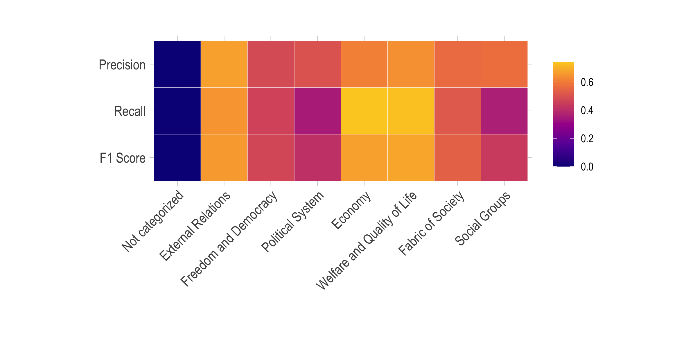

```{r setup, include=FALSE}
knitr::opts_chunk$set(echo = FALSE)
# Load dependencies 
library(tidyverse) # for all the fun tidy data things
library(viridis) # pretty colors
library(tibble) # for row-wise tibble creation
library(reticulate) # For rendering Python code 

# ggplot defaults 
ggplot2::theme_set(theme_minimal())
```

```{r head-img, echo = FALSE, layout = "l-screen-inset"}

```

 {#abstract}
============

  Hand-labeled political texts are often required in empirical studies
  on party systems, coalition building, agenda setting, and many other
  areas in political science research. While hand-labeling remains the
  standard procedure for analyzing political texts, it can be slow and
  expensive, and subject to human error and disagreement. Recent studies
  in the field have leveraged supervised machine learning techniques to
  automate the labeling process of electoral programs, debate motions,
  and other relevant documents. We build on current approaches to label
  shorter texts and phrases in party manifestos using a pre-existing
  coding scheme developed by political scientists for classifying texts
  by policy domain and policy preference. Using labels and data compiled
  by the Manifesto Project, we make use of the state-of-the-art
  Bidirectional Encoder Representations from Transformers (BERT) in
  conjunction with Convolutional Neural Networks (CNN) and Gated
  Recurrent Units (GRU) to seek out the best model architecture for
  policy domain and policy preference classification. We find that our
  proposed BERT-CNN model outperforms other approaches for the task of
  classifying statements from English language party manifestos by major
  policy domain.

## Background {#background}

During campaigns, political actors communicate their position on a range
of key issues to signal campaign promises and gain favor with
constituents. Whilst identifying the political positions of political
actors provides no certainty with regards to whether they act upon their
policy preferences, it remains essential to understanding their intended
political actions. Quantitative methods, especially in the field of natural language
processing, have enabled the development of more scalable methods for
predicting policy preferences. These advancements have enabled political
scientists to analyze political texts and estimate their positions over
time [@nanni2016topfish; @zirn2016classifying]. To better understand
the political positions of political actors, many social science
researchers have turned to hand-labeling political documents, such as
parliamentary debate motions and party manifestos. Much of the previous
work on analyzing political texts relies on hand-labeling documents
[@abercrombie2018sentiment; @gilardi2009learning; @krause2011policy; @simmons2004globalization].
Yet, the analysis of political documents in this field stands to benefit
from automating the coding of texts using supervised machine learning.
Most recently, neural networks and deep language representation models
have been employed in state-of-the-art approaches to automatic labeling
of political texts by policy preference.

In this article, we present a deep learning approach to classifying
labeled texts and phrases in party manifestos, using the coding scheme
and documents from Manifesto Project [@volkens2019manifesto]. We use
English-language texts from the Manifesto Project Corpus, which divides
party manifestos into statements---or *quasi-sentences*---that do not
span more than one grammatical sentence. Based on the state-of-the-art
deep learning methods for text classification, we propose using
Bidirectional Encoder Representations from Transformers (BERT) combined
with neural networks to automate the task of labeling political texts.
We compare our models that combine BERT and neural
networks against previous experiments with similar architectures to
establish that our proposed method outperforms other approaches commonly
used in natural language processing research when it comes to choosing
the correct policy domain and policy preference. We identify differences
in performance across policy domains, paving the way for future work on
improving deep learning models for classifying political texts.

## Related Work {#related_work}

Several studies have concentrated on building scaling models that
identify the political position of texts
[@glavavs2017cross; @laver2003extracting; @nanni2019political; @proksch2010position].
Previously, most of the seminal work in this area has overlooked the
task of classifying texts by topic or policy area prior to detecting
policy preferences associated with the topic. Over the past couple of
years, several studies have addressed the gap in *opinion-topic
identification* by classifying text data from political speeches,
manifestos, and other documents by topic before predicting policy
preference. Perhaps most relevant to our research is the paper by @zirn2016classifying, in
which the authors trained and validated an approach to classifying
manifestos from the United States into seven policy domains that
involved binary classifiers predicting whether sentences that are
adjacent to one another belong to the same topic[^1]. Their proposed
approach of optimizing predictions using a Markov Logic framework
yielded an average micro-F1 score of .749. @glavavs2017cross introduced a multi-lingual
classifier for automatically labeling texts by policy domain. For
classification of 20,196 English-language manifestos by policy domain,
their CNN models yielded an average micro-F1 score of .59.

More recently, studies have employed neural networks and deep language
representation models to address the computationally intensive task of
classifying political texts into over thirty categories. To take on this
ambitious task, included contextual information about individual
quasi-sentences, specifically political party and the previous sentence
within a manifesto, into multi-scale convolutional neural networks with
word embeddings. Their best performing model for classifying 86,500
quasi-sentences from the Manifesto Project Corpus into the seven major
policy domains yielded an F1 score of .6532, and their best performing
model for classifying quasi-sentences by policy preference yielded an F1
score of .4273. propose employing a hierarchical sequential deep model
that captures information from within manifestos as well as contextual
information across manifestos to predict the political position of
texts. Their best performing hierarchical modeling approach for
classifying 86,603 English language quasi-sentences yielded an F1 score
of .50.

Abercrombie et al. (2019) [@abercrombie2019policy] used deep language representation models to detect the policy positions
of Members of Parliament in the United Kingdom. Using motions and
manifestos as data sources, the authors employed a variety of methods to
predict the policy and domain labels of texts. They propose utilizing
BERT for this task, with results fine-tuned with party manifestos and
the motions themselves. In addition to a final softmax layer, the
authors added a CNN model and max-pooling layers to the soft-max layer.
they found that the use of BERT demonstrated
state-of-the-art performance on both manifestos and motions via
supervised pipelines with a Macro-F1 score of 0.69 for their best
performing model. Our work builds on some of the methods proposed in
their paper, leveraging neural networks and deep language representation
models for classifying political texts.

## The Manifesto Project Corpus {#data}

The Manifesto Project Corpus[^2] provides
information on policy preferences of political parties from seven
different countries based on a coding scheme of 8 policy domains,
under which 58 policy preference codes are manually coded[^3]. The Manifesto
Project offers data that divides party manifestos into quasi-sentences,
or individual statements which do not span more than one grammatical
sentence. Quasi-sentences are then individually assigned to categories
pertaining to policy domain and preference. The 58 policy preference
codes, one of which is "not categorized", refer to the
position---positive or negative---of a party regarding a particular
policy area. The 58 policy preference codes fall into a macro-level
coding scheme comprising of 8 policy domain categories. In political
science research, the Manifesto Project Corpus is particularly useful
for studying party competition, the responsiveness of political parties
to constituent preferences, and estimating the ideological position of
political elites. While the official classification of manifestos in
this dataset has primarily relied on human coders, the investigation of
automatically detecting policy positions of the text data is valuable
for scaling up the classification of large volumes of political texts
available for analysis.

<aside> 

Each of domain comprises of minor categories, also known as [policy preferences](https://manifesto-project.wzb.eu/down/data/2020a/codebooks/codebook_MPDataset_MPDS2020a.pdf). For instance, the policy preferences listed under the "External Relations" domain include: 

- Foreign Special Relationships
- Anti-Imperialism
- Military
- Peace
- Internationalism
- European Community/Union

</aside>


Our final subset of all English-language manifestos comprises of 99,681
quasi-sentences. Figures \@ref(fig:desc-pd) and \@ref(fig:desc-country) illustrate the distribution of English-language
manifestos across countries and policy domains. To ensure that the ratio
between policy domains remains consistent across all categories in
running our models, we applied a 70/15/15 split between training,
validation, and test sets separately for all policy domains (major categories) and policy preferences (minor categories). 

```{r desc-pd, eval = TRUE, echo = FALSE, out.width = '50%', fig.cap = "Quasi-sentences (QSs) from English language manifestos by policy domain"}
# 

pd_df <- tribble(
  ~"Domain",                      ~"QSs",
  "External Relations",            6580, 
  "Freedom and Democracy",         4700,
  "Political System",              10557,
  "Economy",                       24757,
  "Welfare and Quality of Life",   30750,
  "Fabric of Society",             11099,
  "Social Groups",                 9910, 
  "Not categorized",               1328
) %>% mutate(Domain = as_factor(Domain))
  
ggplot(pd_df, aes(x = fct_rev(Domain), y = QSs, fill = QSs)) +
  geom_bar(stat = "identity", position = "dodge") +
  geom_text(aes(label = QSs, hjust = -.1)) +
  labs(x = "", y = "# QSs") +
  ylim(0, 33000) +
  scale_fill_viridis(option = "plasma") +
  coord_flip() +
  theme(legend.position = "none")
```

```{r desc-country, eval = TRUE, echo = FALSE, out.width = '50%', fig.cap = "Quasi-sentences (QSs) from English language manifestos by country"}
# knitr::include_graphics("figures/desc-country.png")

c_df <- tribble(
  ~"Country",                      ~"QSs",
  "United States",                  10819, 
  "South Africa",                   6423,
  "New Zealand",                    28561,
  "Ireland",                        25352,
  "Great Britain",                  14839,
  "Canada",                         3047,
  "Australia",                      10370, 
) %>% mutate(Domain = as_factor(Country))

ggplot(c_df, aes(x = fct_rev(Country), y = QSs, fill = QSs)) +
  geom_bar(stat = "identity", position = "dodge") +
  geom_text(aes(label = QSs, hjust = -.1)) +
  labs(x = "", y = "# QSs") +
  ylim(0, 33000) +
  scale_fill_viridis(option = "plasma") +
  coord_flip() +
  theme(legend.position = "none")
```

## Experimental Setup {#methodology}

### Bidirectional Encoder Representations from Transformers (BERT)

Bidirectional Encoder Representations from Transformers
(BERT) have proven successful in prior attempts to
classify phrases and short texts [@devlin2018bert].
BERT's key innovation lies in its ability to apply
bidirectional training of transformers to language modeling. This
state-of-the-art deep language representation model uses a "masked
language model", enabling it to overcome restrictions caused by the
unidirectional constraint.

Our experiments use the standard pre-trained BERT
transformers as the embedding layer in our model. Since
BERT is trained on sequences with a maximum lengths of 512
tokens, all quasi-sentences with more than 510 words were trimmed to fit
this requirement. Pre-trained embeddings were frozen and not trained for
the base models. We test two variants of BERT---one
incorporating a bidirectional GRU model, and another incorporating CNNs.
Model specifications and training times for our neural networks and deep
language representation models are shown in Table
[1](#tab:modelspec){reference-type="ref" reference="tab:modelspec"} and
Figure \@ref(fig:tt).

::: {#tab:modelspec}
| Models   | Text Representation   | Layers                                                                                               | Epochs |
|----------|-----------------------|------------------------------------------------------------------------------------------------------|--------|
| CNN      | GloVe Wikipedia w-emb | 2 Convolutional Layers (1 per filter)<br>2 Max Pooling Layers<br>1 Dropout Layer <br>1 Linear Layer  | 100    |
| BERT-CNN | Base BERT (uncased)   | 2 Convolutional Layers (1 per filter)<br>2 Max Pooling Layers <br>1 Dropout Layer <br>1 Linear Layer | 10     |
| BERT-GRU | Base BERT (uncased)   | 1 Bidirectional GRU RNN Layer <br>1 Dropout Layer <br>1 Linear Layer                                 | 10     |

Table: Table 1: Model specifications of neural networks and deep language representation models 

:::

```{r tt, out.width = '100%', fig.cap = "Training time for neural networks and deep language representation models for classifying political texts by *major* and *minor* policy domain"}

```


### BERT with Gated Recurrent Units (GRU)

First proposed by Cho et al. (2014) [@cho2014learning], Gated Recurrent Units---formerly referred
to as the RNN Encoder-Decoder model---use update gates and reset gates
to solve the vanishing gradient problems often encountered in
applications of recurrent neural networks [@kanai2017preventing]. The
update gate helps the model determine the extent to which past
information is carried on in the model whilst the reset gate determines
the information to be removed from the model [@chung2014empirical].
Hence, it solves the aforementioned problem by not completely removing
the new input, instead keeping relevant information to pass on to
further subsequent computed states. In our analysis, we employ a
multi-layer, bidirectional GRU model from PyTorch[^3] (Table
[1](#tab:modelspec){reference-type="ref" reference="tab:modelspec"}). The
results are subject to a dropout layer prior to classification via a
linear layer.

### BERT with Convolutional Neural Networks (CNN)

We incorporate CNNs with BERT using the same CNN
architecture as our baselines (Table
[1](#tab:modelspec){reference-type="ref" reference="tab:modelspec"}).
The model utilizes the aforementioned BERT base, uncased
tokenizer with convolutional filters of sizes 2 and 3 applied with a
ReLu activation function. We use a 1D-max pooling layer, a dropout layer
($N = 0.5$) to prevent overfitting, and a Cross Entropy Loss function.
We employ the model to classify policy domains ($N = 8$) and policy
preferences ($N = 58$), each of which includes a category for
quasi-sentences that do not fall into this classification scheme.
Hereafter, we refer to these classifications as 'major' and 'minor'
categories, respectively. A graphical representation of our model is
shown in Figure \@ref(fig:bertcnn-fig).

```{r bertcnn-fig, out.width = '50%', fig.cap = "Graphical representation of the base BERT-CNN model to predict major policy domains"}
knitr::include_graphics("figures/BERTfig3.png")
```

### Evaluation

We evaluate the performance of our proposed method against several
baselines:

-   **Multinomial Naive Bayes** [@su2011large]: This algorithm, commonly used in text
    classification, operates on the *Bag of Words assumption* and the
    assumption of *Conditional independence*.

-   **Support Vector Machines** [@tong2001support]: We used this
    traditional binary classifier to calculate baselines with the `SVC`
    package from `scikit-learn`[^4], employing a "one-against-one"
    approach for multi-class classification.

-   **Convolutional Neural Networks (CNN)**
    [@DBLP:journals/corr/Kim14f; @lecun1998gradient]: To run this deep
    learning model, originally designed for image classification, we
    first made use of pre-trained word vectors trained by GloVe, an
    unsupervised learning algorithm for obtaining vector representations
    for words [@Pennington_Socher_Manning_2014].

To evaluate model fit, we utilized *accuracy* and *loss* as key metrics
to compare performance of our *CNN* baseline
and our proposed models (BERT-CNN,
BERT-GRU). We calculated the *F1-score* for each model
that we ran. In our results, we present both the Macro-F1 score and
Micro-F1 score[^6].

### Architecture fine tuning

We tested different modifications of the CNN and BERT
models. For the CNN models, we compared the following modifications:

-   **Stemming and Lemmatization**: We test whether stemming or
    lemmatizing text in the pre-processing steps improves predictions
    using quasi-sentences from the Manifesto Project Corpus.

-   **Dropout rates**: We decreased the dropout rate from 0.5 to 0.25 to
    determine whether fine-tuning dropout rates yield differences in
    performance. This is because we initially found that our models were
    overfitting.

-   **Additional linear layer**: An additional linear layer was added
    prior to the final categorization linear layer to establish whether
    "deeper" neural networks generate improved predictions.

-   **Removal of uncategorized quasi-sentences**: We removed quasi-sentences 
    that were labeled as "not categorized" to investigate whether predictions improve 
    with an altered classification scheme of 7 specified policy domains and 57 
    policy preference codes[^7]. 

For the BERT models, we compared the following
modifications:

-   **Training Embeddings**: For our base BERT models, all
    training of embeddings were frozen. Therefore, we enable training of
    the embeddings in this modification to establish how training
    embeddings contributes to the performance of deep language
    representation models with this classification task.

-   **Training models based on recurrent runs**: We trialed training the
    BERT models sequentially with different learning rates
    (LR = 0.001, 0.0005 and 0.0001) of 10 epochs each for a total of 30
    epochs in aims to improve the performance of our neural networks and
    deep language representation models.

-   **Large, cased tokenizer**: The BERT Large cased
    tokenizer was used instead of the BERT BASE uncased
    tokenizer employed in our base models.

### Results

As shown in Table [2](#tab:modelresults), the BERT-CNN model
performed best for predicting both major and minor categories compared
to the BERT-GRU model and CNN baseline. However, our SVM baseline
outperformed the neural network models for predicting minor categories.
We believe that the shortcomings of our neural networks and deep
language representation models for this text classification task are due
to limitations in specifying the number of epochs in training. We also
observed overfitting in our models. For instance, with our CNN model,
validation loss increased with each additional epoch after a certain
number of epochs. As shown in Figure \@ref(fig:major-overfitting), training accuracy of this model
also increased at the cost of validation accuracy. However, this was not
the case for deep language representation models classifying texts by
minor categories. Overall, our results show that, between the two
BERT models, the BERT-CNN model demonstrates
superior performance against bag-of-words approaches and other models
that utilize neural networks.

::: {#tab:modelresults}
| Category | Model    | Test Loss | Test Accuracy | Micro-F1 | Macro-F1 |
|----------|----------|-----------|---------------|----------|----------|
| _Major_
|          | MNB      | ---       | 0.553         | 0.553    | 0.398    |
|          | SVM      | ---       | 0.578         | 0.578    | 0.460    |
|          | CNN      | 1.177     | 0.589         | 0.589    | 0.466    |
|          | BERT-GRU | 1.166     | 0.594         | 0.593    | 0.479    |
|          | BERT-CNN | __1.152__     | __0.591__         | __0.591__    | __0.473__
| _Minor_        
|          | MNB      | ---       | 0.385         | 0.385    | 0.154    |
|          | SVM      | ---       | __0.463__         | __0.463__    | __0.299__    |
|          | CNN      | 2.136     | 0.454         | 0.454    | 0.273    |
|          | BERT-GRU | 2.216     | 0.432         | 0.432    | 0.239    |
|          | BERT-CNN | __2.098__     | 0.448         | 0.448    | 0.260    |

Table: Table 2: Baseline, CNN and BERT models run with base model specifications as detailed in Table [1](#tab:modelspec)

:::

```{r major-overfitting, out.width = '50%', fig.cap = "An illustration of overfitting in our CNN model for classifying manifesto QSs by major policy domain"}

```

### CNN and BERT Modifications {#cnn-and-bert-modifications .unnumbered}

Comparing modifications to our CNN models, our results suggest that the
base model outperforms most alternative model specifications. As
outlined in Table
[3](tab:model-modifications), reducing the dropout rate to 0.25 improved
the model on some indicators marginally. As expected, the removal of
uncategorized quasi-sentences yielded improvements in predictions, with
a significantly higher Macro-F1 score compared to other model
specifications. Based on these results, future work should focus on how
model predictions of uncategorized quasi-sentences can be improved,
given their random nature.

::: {#tab:model-modifications}

| Model    | Modification                     | Test Loss | Test Accuracy | Micro-F1 | Macro-F1 | Epochs |
|----------|----------------------------|-----------|---------------|----------|----------|--------|
| _CNN_      |                            |           |               |          |          |        |
|          | Base model                 | 1.177     | __0.589__         | __0.589__    | 0.466    | 100    |
|          | Lemmatized text            | __1.174__     | 0.585         | 0.585    | 0.46     | 100    |
|          | Stemmed text               | 1.213     | 0.577         | 0.576    | 0.448    | 100    |
|          | Dropout = 0.25             | 1.177     | __0.589__         | 0.588    | __0.467__    | 100    |
|          | Additional layer           | 1.18      | 0.586         | 0.586    | 0.462    | 100    |
|          | Removing uncategorized QSs | __1.136__     | __0.596__         | __0.595__    | __0.535__    | 100    |
| _BERT-GRU_ |                            |           |               |          |          |        |
|          | Base model                 | __1.152__     | __0.594__         | __0.593__    | __0.479__    | 10     |
|          | Training emb               | 1.163     | 0.592         | 0.592    | __0.479__    | 10     |
|          | Recurrent runs, training   | 1.234     | 0.582         | 0.581    | 0.459    | 30     |
|          | Large, uncased             | 1.172     | 0.592         | 0.591    | 0.469    | 10     |
| _BERT-CNN_ |                            |           |               |          |          |        |
|          | Base model                 | 1.166     | __0.591__         | __0.591__    | __0.473__    | 10     |
|          | Training emb               | 1.167     | 0.587         | 0.587    | 0.458    | 10     |
|          | Recurrent runs, training   | __1.157__     | 0.589         | 0.589    | 0.468    | 30     |
|          | Large, uncased             | 1.192     | 0.58          | 0.58     | 0.45     | 10     |

Table: Table 3: Comparing results of modifications to CNN and BERT base models for predicting policy domains

::: 

While we observed some improvements with modifications to the CNN model,
we find that our base BERT models performed best compared
to other fine-tuned modifications to model architecture. The results of
our base BERT model and alternative model specifications
are shown in Table
[3](tab:model-modifications). Even though it is possible that our base
BERT model is best for this classification model, our
results could also indicate the presence of over-fitting or the lack of
sufficient training available given the low number of epochs.

## Limitations and Analysis {#discussion}

As shown in Figure \@ref(fig:major-overfitting), we observed overfitting with our
major policy domain classification models. Despite employing changes and
modifications to our models, including varied dropout rates,
architecture fine-tuning and different learning rates, we did not find
any variants of the models employed in analysis that would yield
significant improvements in performance. We posit that potential
improvements on these issues could be resolved by employing transfer
learning and appending our sample of English-language manifestos with
other political documents, such as debate transcripts.

In contrast, as shown in Figure \@ref(fig:minor-overfitting), we observed little over-fitting in
our minor policy domain classification models. Our classifier could
benefit from employing transfer learning and appending our sample of
manifesto quasi-sentences with other political texts, especially for
policy domains with relatively fewer quasi-sentences to train on. It is
also important to note that, compared to the more computationally
intensive neural networks and deep language representation models, our
Multinomial Bayes and SVM baselines did not perform significantly worse.
In fact, for the minor categories, the SVM yielded superior performance
in some metrics compared to that of the neural network models.
Notwithstanding the lack of training of certain models, this may suggest
that increasing the model complexity and consequently the computational
power required may not necessarily lead to increased model performance.

```{r minor-overfitting, out.width = '50%', fig.cap = "Training and validation metrics for the BERT-CNN model for classifying English language manifestos by policy preference"}

```

Substantially lower Macro-F1 scores across all models point to mixed
performance in classification by category. As shown in Figure
\@ref(fig:prf1-major), we observe high variation in the performance
of our classifiers between categories. However, we observe poor
performance in classifying quasi-sentences that do not belong to one of
the major policy domains. For our BERT-CNN model, the easiest categories
to predict were "welfare and quality of life", "economy", and "freedom
and democracy". The superior performance of predicting the first two
categories is not particularly surprising, as a substantial number of
quasi-sentences in our sample of English-language party manifestos are
attributed to these topics. As shown in Figure \@ref(fig:desc-pd),
30,750 quasi-sentences are attributed to the "welfare and quality of
life" category and 24,757 quasi-sentences are attributed to the
"economy" domain.
 
```{r prf1-major, out.width = '50%', fig.cap = "Average precision, recall, and Macro-F1 scores by major policy domain across all models"}

```

<!-- <aside> -->

<!-- The numbers on the x-axis correspond to their respective policy domains: -->

<!-- - __0__: Not categorized  -->
<!-- - __1__: External Relations  -->
<!-- - __2__: Freedom and Democracy  -->
<!-- - __3__: Political System  -->
<!-- - __4__: Economy -->
<!-- - __5__: Welfare and Quality of Life  -->
<!-- - __6__: Fabric of Society  -->
<!-- - __7__: Social Groups  -->

<!-- </aside> -->

In contrast, the relatively superior performance of predicting the
"freedom and democracy" category is surprising. Out of our total sample
of $n_{\mathrm{sentences}}=99,681$, only 4,700 documents are attributed
to the "freedom and democracy" category. Intuitively, the performance of
our classifier with this underrepresented policy domain could be
attributed to a variety of possible explanations. One is the presence of distinct features such as topic-unique
vocabulary that do not exist in other categories. Future work on
classification of political documents that fall under this category
would benefit from looking into features that might distinguish this
policy domain from others.

## Conclusion {#conclusion}

In this paper, we trained two variants of
BERT---one incorporating a bidirectional GRU model, and
another incorporating CNNs. We demonstrate the superior performance of
deep language representation models combined with neural networks to
classify political domains and preferences in the Manifesto Project. Our
proposed method of incorporating BERT with neural networks
for classifying English language manifestos addresses issues of
reproducibility and scalability in labeling large volumes of political
texts. As far as we know, this is the most comprehensive application of
deep language representation models and neural networks for classifying
statements from political manifestos.

We find that using BERT in conjunction with CNNs yields the best predictions for classifying English
language statements parsed from party manifestos. However, our proposed
BERT-CNN model requires further fine-tuning to be
effective in providing acceptable predictions to improve on less
computationally intensive methods and replace human annotations of
fine-grained policy positions. As expected, our proposed approach and
baselines perform better for classifying major policy domains over minor
categories. We also observe differences in performance between
categories. Among the major policy domains, the categories that
performed best include "welfare and quality of life", "economy", and
"freedom and democracy". The superior performance of the latter category
is surprising because it makes up the smallest proportion of
quasi-sentences in the Manifesto Project Corpus.

There are several avenues for future work on neural networks and deep
language representation models for automatically labeling political
texts. For instance, investigating the features of individual categories
that demonstrate superior performance would shed light on how we can
incorporate additional features of texts to improve model performance.
This area of research would also benefit from better understanding how
we can filter out texts that do not fall into a particular
classification scheme. Knowledge on how these issues could be resolved
to improve model performance would allow for extensions in the
application of deep learning models for classifying political texts.

[^1]: The data used in analysis comprises of statements from six
    Democratic and Republican election manifestos from the 2004, 2008
    and 2012 elections in the United States.

[^2]: <https://manifesto-project.wzb.eu/>

[^3]: The classification scheme of 8 policy domains and 58 policy preferences each include a category of quasi-sentences that are not considered part of any meaningful category. 

[^4]: <https://pytorch.org/>

[^5]: <https://scikit-learn.org/stable/>

[^6]: The micro score calculates metrics globally, whilst the macro score
    calculates metrics for each label and reports the unweighted mean. 

[^7]: This modification is motivated by the results from our base models, which yield lower Macro-F1 scores due to the difficulty of correctly identifying the quasi-sentences that were "not categorized". 

